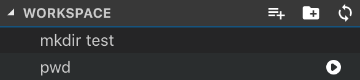
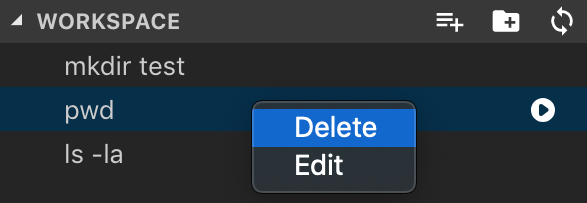

# Command List 

Run and Save commands in WorkSpace or Global

## Features

- Save and display command like File Explorer
- Select and execute command in terminal

## Usage

### navigation

Add Command - Add Folder - Update Explorer

### command list

#### Execute Command

click play mark

#### Deletion or Edit Command

right-click on command

## Release Notes

### 1.0.2

Put commands in alphabetical order

### 1.0.1

Fix light theme icon.

### 1.0.0

Initial release of commandlist.

### 0.2.0

Function addition of command group.

### 0.1.0

create command explorer and command executer.

-----------------------------------------------------------------------------------------------------------

## Changelog

see [here](https://github.com/yamajyn/commandlist/blob/master/CHANGELOG.md)

## License
MIT

**Happy Coding!**  😎
